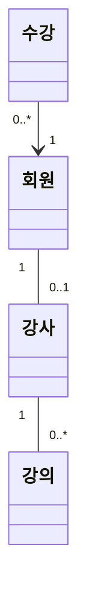

# Clean Spring 도메인 모델

## Clean Spring 도메인
- 이 도메인은 무엇 무엇을 제공한다.

## 도메인 모델

### 회원
_Entity_
#### 속성
- `email`: 이메일 - ID
- `nickname`: 닉네임
- `passwordHash`: 비밀번호
- `status`: 회원 상태

#### 행위
- `static create()`: 회원 생성: email, nickname, password, passwordEncoder
- `activate()`: 가입을 완료 시킨다
- `deactivate()`: 탈퇴시킨다
- `verifyPassword()`: 비밀번호를 검증한다
- `changeNickname()`: 닉네임을 변경한다
- `changePassword()`: 비밀번호를 변경한다

#### 규칙
- 회원 생성후 상태는 가입 대기(MemberStatus.PENDING)
- 일정 조건을 만족하면 가입 완료가 된다
- 가입 대기 상태에서만 가입 완료가 될 수 있다
- 가입 완료 상태(MemberStatus.ACTIVE)에서는 탈퇴할 수 있다
- 회원의 비밀번호는 해시를 만들어서 저장한다
- 비밀번호를 해시를 이용해서 검증한다

### 회원 상태(MemberStatus)
_Enum_

#### 상수
- `PENDING`: 가입 대기
- `ACTIVE`: 가입 완료
- `DEACTIVATED`: 탈퇴

### 비밀번호 인코더(PasswordEncoder)
_Domain Service(Interface)_

#### 행이
- `encode()`: 비밀번호 암호화하기
- `matches()`: 비밀번호 일치하는지 확인

### 강사
### 강의
### 수업
### 섹션
### 수강
### 진도

## 다이어그램

